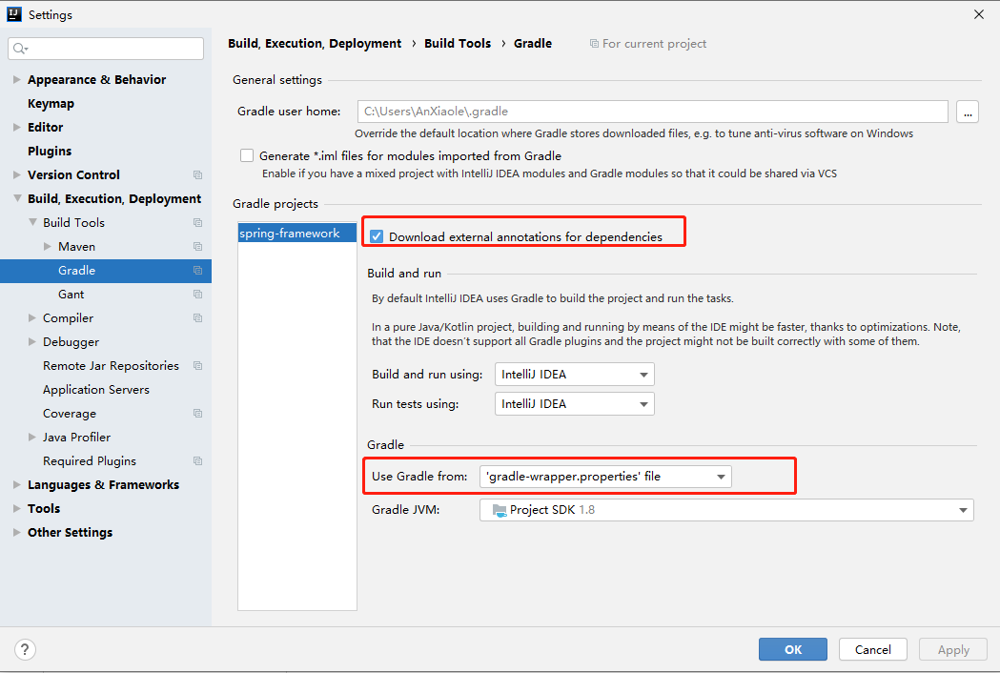

# 这里是我和小伙伴整理的spring源码注释项目
# 如有不正，欢迎交流！~
### 请积极地发邮件指正注释中的错误，不胜感激！~  guosheng.tan@foxmail.com

#  Spring Framework

如何导入idea：

用以下链接下载 gradle 4.9 版本（radle-src为gralde源码，gradle-bin为安装包，gradle-all为源码加安装包）
(idea 自带的 gradle 版本可能更新（5.0）或者更老，会有各种编译问题)
https://services.gradle.org/distributions/gradle-4.9-bin.zip

配置环境变量：
GRADLE_HOME=/Users/***/tools/gradle-4.9
Path引入环境变量，例子如下：
PATH=$GRADLE_HOME/bin:$PATH:.

命令行 gradle -v 检测 gradle 是否安装成功。。。

idea -> Preferences | Build, Execution, Deployment | Build Tools | Gradle 配置为自己下载的gradle地址（idea）

jdk版本为1.8， 我的为1.8.0_161-b12，可以编译成功

跑一下 build.gradle，等到片刻 即可... 

P.s.: 此源码编译配置和官方不完全一致，有适当的增删

# 【遇到问题及解决方案】

## 一、IDEA Gradle项目控制台输出乱码

解决方案参考：https://blog.csdn.net/xiaopihair123/article/details/105161231 （记得重启idea)

## 二、

This is the home of the Spring Framework, the foundation for all
[Spring projects](https://spring.io/projects). Together the Spring Framework and the family of Spring projects make up what we call "Spring". 

Spring provides everything you need beyond the Java language to create enterprise
applications in a wide range of scenarios and architectures. Please read the
[Overview](https://docs.spring.io/spring/docs/current/spring-framework-reference/overview.html#spring-introduction)
section in the reference for a more complete introduction.

## Code of Conduct

This project is governed by the [Spring Code of Conduct](CODE_OF_CONDUCT.adoc).
By participating you are expected to uphold this code.
Please report unacceptable behavior to spring-code-of-conduct@pivotal.io.

## Access to Binaries

For access to artifacts or a distribution zip, see the
[Spring Framework Artifacts](https://github.com/spring-projects/spring-framework/wiki/Spring-Framework-Artifacts)
wiki page.

## Documentation

The Spring Frameworks maintains reference documentation
([published](https://docs.spring.io/spring-framework/docs/current/spring-framework-reference/) and
[source](src/docs/asciidoc)),
Github [wiki pages](https://github.com/spring-projects/spring-framework/wiki), and an
[API reference](https://docs.spring.io/spring-framework/docs/current/javadoc-api/).
There are also [guides and tutorials](https://spring.io/guides) across Spring projects.

## Build from Source

See the [Build from Source](https://github.com/spring-projects/spring-framework/wiki/Build-from-Source)
wiki page and also [CONTRIBUTING.md](CONTRIBUTING.md).

## Stay in Touch

Follow [@SpringCentral](https://twitter.com/springcentral),
[@SpringFramework](https://twitter.com/springframework), and its
[team members](https://twitter.com/springframework/lists/team/members) on Twitter.
In-depth articles can be found at [The Spring Blog](https://spring.io/blog/),
and releases are announced via our [news feed](https://spring.io/blog/category/news).

## License

The Spring Framework is released under version 2.0 of the
[Apache License](https://www.apache.org/licenses/LICENSE-2.0).
